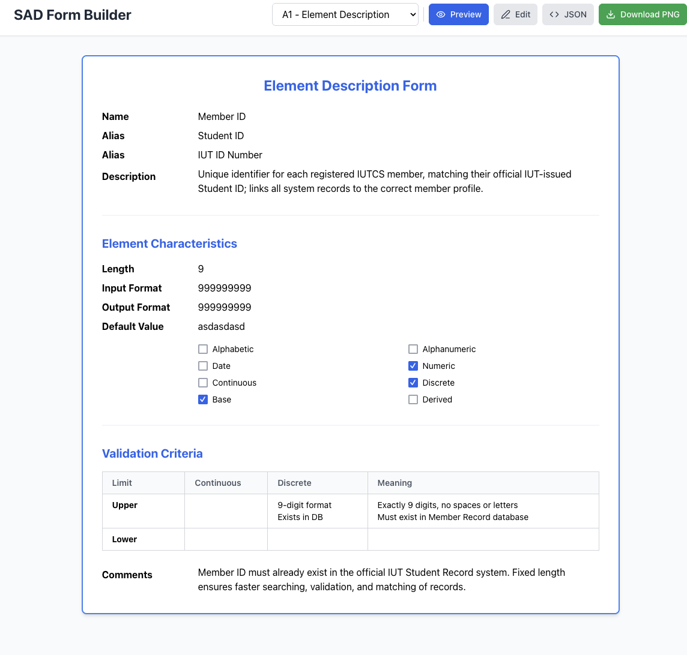

# SAD Form Builder

**Original Creator:** [SAD Form Builder](https://www.google.com/search?q=https://github.com/your-original-repo-link)
*Modified by Claude and Gemini*

This is a dynamic web application built with React that allows you to view, edit, and generate forms for a System Analysis and Design (SAD) document. It provides three pre-configured forms: Element Description, Data Flow Description, and Data Store Description. The forms are based on a JSON configuration, which can also be viewed and edited directly within the application.

-----

## Features

  * **Multi-Form View:** Easily switch between three different pre-configured SAD forms.
  * **Preview Mode:** View the forms in a clean, read-only format.
  * **Edit Mode:** Modify form fields directly in the browser. Changes are reflected instantly and saved to the application's state.
  * **JSON Editor:** For advanced users, a JSON view allows you to inspect and modify the entire form configuration directly.
  * **PNG Download:** Export the currently viewed form as a PNG image for easy inclusion in documents.

  

-----

## Usage

1.  **Select a Form:** Use the dropdown menu in the header to choose between the "Element Description," "Data Flow Description," and "Data Store Description" forms.
2.  **View and Edit:**
      * Click the **"Preview"** button to see the form in a read-only state.
      * Click the **"Edit"** button to enable editing of the form fields.
      * Click the **"JSON"** button to view and edit the underlying JSON configuration. Make sure your JSON is valid before applying changes by clicking **"Apply Changes"**.
3.  **Download as PNG:** Click the **"Download PNG"** button to save an image of the current form.

> **⚠️ Note on PNG Export:** The current PNG export functionality has a known issue where the checkmark icons inside the checkboxes are not perfectly centered in the exported image. While this issue is being worked on, we recommend using a standard screenshot tool to capture a clean image of the form if this is a concern.

-----

## Technical Details

This project is a React application created with Vite. It uses:

  * **React:** For building the user interface.
  * **Tailwind CSS:** (Inferred from class names like `bg-blue-600`, `flex`, `p-8`) For a utility-first CSS framework to handle styling.
  * **Lucide React:** For a collection of beautiful and customizable open-source icons.
  * **html2canvas:** To capture the form's HTML content and render it as a canvas, which is then converted into a PNG image.

-----

## Installation

To run this project locally, follow these steps:

1.  Clone the repository:
    ```bash
    git clone https://github.com/your-repo-link.git
    cd sad-form-builder
    ```
2.  Install the dependencies:
    ```bash
    npm install
    ```
3.  Start the development server:
    ```bash
    npm run dev
    ```
